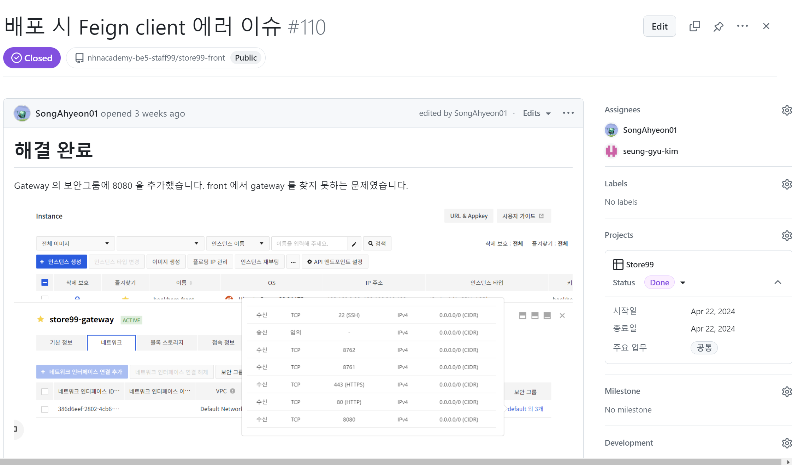
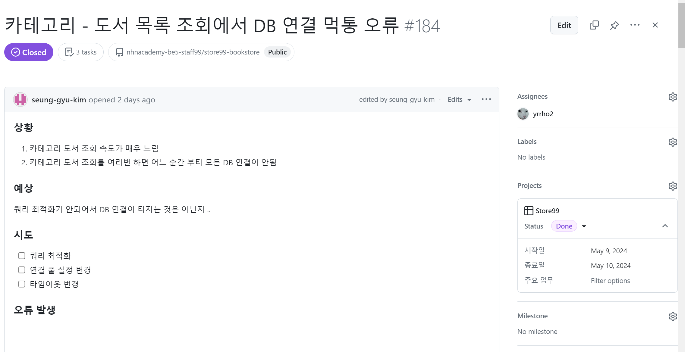
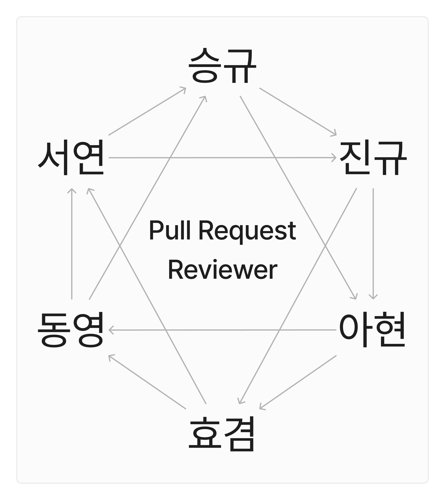
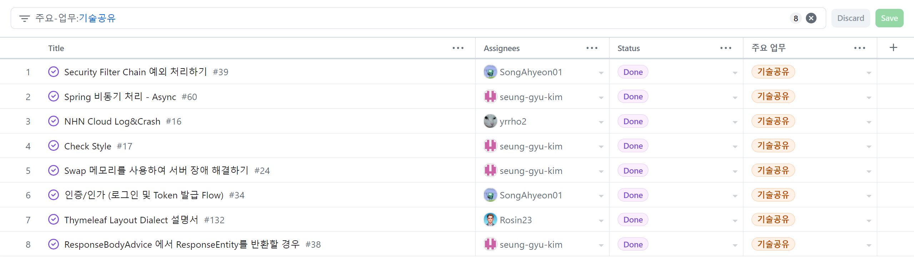

# 📖 온라인 서점, Store99st
**배포 url :** https://store99st.shop

**Github :** https://github.com/nhnacademy-be5-staff99

**개발 기간 :** 2024.03.01 - 2024.05.22

**컨벤션 :** [convention.md](https://github.com/nhnacademy-be5-staff99/.github/blob/main/convention.md)

 

# Members

|||||||
|:---:|:---:|:---:|:---:|:---:|:---:|
|[김승규](https://github.com/seung-gyu-kim)|[노동영](https://github.com/yrrho2)|[송아현](https://github.com/SongAhyeon01)|[송진규](https://github.com/Rosin23)|[이서연](https://github.com/SeoYeonLee12)|[진효겸](https://github.com/jinhyogyeom)|
| 게이트웨이/유레카 | 로그 | 인증/로그인 | 태그 | 좋아요 | 회원 가입 |
| 카테고리 | 도서 | 마이페이지 | 포인트 | 리뷰 | 검색 |
| 장바구니 | | 검색 ||||
| 주문/결제 | | 쿠폰 ||||

 

# 🌏 Development Environment
### 개발 도구

### 개발 언어

### 빌드 도구

### 개발
  

### 테스트
### DB
 

### 검색엔진
### UI
### Cloud
**NHN CLOUD**

- Instance
- 

### 배포
 

### ECT
 

# 🏗️ Project Architecture

# 🚀 CI/CD

# 💿 ERD

# 🤖 Project Management
> Github의 기능 `Projects`를 사용하여 프로젝트 관리

### WBS
Github Project 로 각 작업마다 이슈로 등록하여 관리

### Roadmap - 일정관리
Github Project 의 Roadmap 을 이용한 멤버별 일정 관리

### Board - 작업 관리

Github Project 의 Board 을 이용한 멤버별 작업 관리
- Todo, InProgress, CodeReview, Delay, Done 으로 나누어 상태 확인

### Scrum
Scrum 을 Github Issue 로 관리
- 주마다 Scrum Master를 변경하고 투표를 통해 마지막 2주의 Scrum Master를 고정
- 매일 09시에 스크럼을 진행. 특이사항 발생시 Scrum Master를 통하여 일정 변경
- 팀원간 진행사항과 그 날의 Task를 정리하고 특이사항을 공유함으로써 팀원간 협력적이고 체계적인 프로젝트 진행

### 이슈 관리
- 에러나 버그 등 이슈 발생 시 Github Issue 로 등록하여 Github Projects에서 관리
- 다른 팀원의 이슈 발견시 Github Issue 생성 후 Assignees에 등록하여 건의

### Code Review
- 각각의 팀원은 다른 2명의 Pull Request 코드리뷰를 컨벤션 규칙에 따라 성실히 수행
- Pull Request의 수정사항과 관련된 팀원은 임의로 리뷰어에 추가, 변경 될 수 있음

### 기술 공유
팀원간의 협업과 개발의 효율을 상승시키기 위해 각자 학습한 기술을 WBS Issue로 등록, 작성하여 공유

# 🧪 Test
## Test Coverage

## Black Box Test
## Unit Test

# 🖐️ Member Role
## 공통
- 프로젝트 요구사항 분선
- WBS 작성
- DB 설계
- CI/CD 환경 구축
- API 스펙 정의
- 도메인 준비
- 화면 구성
- 팀 규칙 정립
- 역할 분담

## 김승규
### 장바구니
### 주문
### 결제

### 기타
- 코드 스타일 정립 / Git 컨벤션 통일 / PR 및 팀 규칙 정립
  - [convention.md](https://github.com/nhnacademy-be5-staff99/.github/blob/main/convention.md)

## 노동영
### Logging
### 도서

## 송아현
### 인증/인가
### 마이페이지
### 단순 검색
### 쿠폰

## 송진규
### 태그
### 포인트

### 기타
- 템플릿 정하기

## 이서연
### 좋아요
### 리뷰

## 진효겸
### 회원
### 검색

