# 📖 온라인 서점, Store99st
**배포 url :** https://store99st.shop, https://www.store99st.shop

**Github :** https://github.com/nhnacademy-be5-staff99

**개발 기간 :** 2024.03.01 - 2024.05.22

**컨벤션 :** [convention.md](https://github.com/nhnacademy-be5-staff99/.github/blob/main/convention.md)

<br>

# Members

|||||||
|:---:|:---:|:---:|:---:|:---:|:---:|
|[김승규](https://github.com/seung-gyu-kim)|[노동영](https://github.com/yrrho2)|[송아현](https://github.com/SongAhyeon01)|[송진규](https://github.com/Rosin23)|[이서연](https://github.com/SeoYeonLee12)|[진효겸](https://github.com/jinhyogyeom)|
| 게이트웨이/유레카 | 로그 | 인증/로그인 | 태그 | 좋아요 | 회원 가입 |
| 카테고리 | 도서 | 마이페이지 | 포인트 | 리뷰 | 검색 |
| 장바구니 | | 검색 ||||
| 주문/결제 | | 쿠폰 ||||
| [세부 업무](#%EA%B9%80%EC%8A%B9%EA%B7%9C) | [세부 업무](#%EB%85%B8%EB%8F%99%EC%98%81) | [세부 업무](#%EC%86%A1%EC%95%84%ED%98%84) | [세부 업무](#%EC%86%A1%EC%A7%84%EA%B7%9C) | [세부 업무](#%EC%9D%B4%EC%84%9C%EC%97%B0) | [세부 업무](#%EC%A7%84%ED%9A%A8%EA%B2%B8) |

<br>

# 🌏 Development Environment
### 개발 도구


### 개발 언어


### 빌드 도구


### 개발
    
   

### 테스트
 

### DB
 

### 검색엔진


### Cloud


### Message Queue


### 협업도구


### ECT
  

### CI/CD
 

### UI


### Front
   

### Logging


# 🏗️ Project Architecture


# 🚀 CI/CD


# 💿 ERD


# 🤖 Project Management
> Github의 기능 `Projects`를 사용하여 프로젝트 관리

### [WBS](https://github.com/orgs/nhnacademy-be5-staff99/projects/1/views/1)
Github Project 로 각 작업마다 이슈로 등록하여 관리


### [Roadmap - 일정관리](https://github.com/orgs/nhnacademy-be5-staff99/projects/1/views/6)
Github Project 의 Roadmap 을 이용한 멤버별 일정 관리


### [Board - 작업 관리](https://github.com/orgs/nhnacademy-be5-staff99/projects/1/views/3)

Github Project 의 Board 을 이용한 멤버별 작업 관리
- Todo, InProgress, CodeReview, Delay, Done 으로 나누어 상태 확인


### [Scrum](https://github.com/orgs/nhnacademy-be5-staff99/projects/1/views/7)
Scrum 을 Github Issue 로 관리
- 주마다 Scrum Master를 변경하고 투표를 통해 마지막 2주의 Scrum Master를 고정
- 매일 09시에 스크럼을 진행. 특이사항 발생시 Scrum Master를 통하여 일정 변경
- 팀원간 진행사항과 그 날의 Task를 정리하고 특이사항을 공유함으로써 팀원간 협력적이고 체계적인 프로젝트 진행


### 이슈 관리
- 에러나 버그 등 이슈 발생 시 Github Issue 로 등록하여 Github Projects에서 관리
- 다른 팀원의 이슈 발견시 Github Issue 생성 후 Assignees에 등록하여 건의


### Code Review
- 각각의 팀원은 다른 2명의 Pull Request 코드리뷰를 컨벤션 규칙에 따라 성실히 수행 [컨벤션: 코드리뷰 규칙](https://github.com/nhnacademy-be5-staff99/.github/blob/main/convention.md#%EC%BD%94%EB%93%9C%EB%A6%AC%EB%B7%B0)
- Pull Request의 수정사항과 관련된 팀원은 임의로 리뷰어에 추가, 변경 될 수 있음


### [기술 공유](https://github.com/orgs/nhnacademy-be5-staff99/projects/1/views/12)
팀원간의 협업과 개발의 효율을 상승시키기 위해 각자 학습한 기술을 WBS Issue로 등록, 작성하여 공유


# 🧪 Test
## Test Coverage
### bookstore 테스트 커버리지


## Black Box Test
- 매 주 개발내용을 배포 시 페이지의 모든 동작을 검사
- 기존 기능과 새로 배포되는 기능을 중점적으로 사이드 이펙트 유무 파악

### Black box test flow


### [테스트 체크리스트](https://github.com/orgs/nhnacademy-be5-staff99/projects/1/views/13)


## White Box Test(Unit Test)
### Controller Test
RestDocSupport와 @WebMvcTest를 활용하여 Controller 단위 테스트 구현

#### RestDocSupport.java
Spring REST Docs을 위한 기능과 관리자 권한을 반환하는 서비스를 Mocking하는 기능이 들어있는 컨트롤러 테스트 지원을 위한 클래스
```java
/**
 * Rest docs를 편리하게 사용하기 위한 Support 클래스
 * @author seunggyu-kim 
 */
@Disabled
@Import(RestDocsConfig.class)
@ExtendWith({RestDocumentationExtension.class})
public abstract class RestDocSupport {
    @Autowired
    protected MockMvc mockMvc;

    @Autowired
    protected ObjectMapper objectMapper;

    @Autowired
    protected RestDocumentationResultHandler restDoc;

    // 관리자 여부 테스트 용으로 사용
    // ex) BDDMockito.given(adminCheckService.isAdmin(Mockito.anyLong())).willReturn(true);
    @MockBean
    protected AdminCheckService adminCheckService;

    /**
     * Spring Rest Docs를 사용하기 위한 설정
     *
     * @param webApplicationContext
     * @param restDocumentationContextProvider
     */
    @BeforeEach
    public void setup(
            final WebApplicationContext webApplicationContext,
            final RestDocumentationContextProvider restDocumentationContextProvider
    ) {
        this.mockMvc = MockMvcBuilders.webAppContextSetup(webApplicationContext)
                .apply(MockMvcRestDocumentation.documentationConfiguration(restDocumentationContextProvider))
                .alwaysDo(MockMvcResultHandlers.print())
                .alwaysDo(restDoc)
                .addFilters(new CharacterEncodingFilter("UTF-8", true))     // 한글 깨짐 방지 처리
                .build();
    }
}
```
#### 컨트롤러 테스트 예시(AdminCheckControllerTest.java)
given, when, then으로 나누어 BDD 방식으로 구현
```java
@WebMvcTest(AdminCheckController.class)
class AdminCheckControllerTest extends RestDocSupport {
    /**
     * 관리자 여부 확인 테스트
     * <p>사용자가 관리자 권한을 갖고있는 경우
     *
     * @throws Exception
     */
    @DisplayName("관리자 여부 확인 - 관리자인 경우")
    @Test
    void checkAdmin_true() throws Exception {
        // given
        Long userId = Mockito.anyLong();
        BDDMockito.given(adminCheckService.isAdmin(userId)).willReturn(true);

        // when
        String response = mockMvc.perform(
                        MockMvcRequestBuilders.get("/v1/admin/check")
                                .header("X-USER-ID", userId))
                .andExpectAll(
                        MockMvcResultMatchers.status().isOk()
                )
                .andReturn().getResponse().getContentAsString();

        // then
        CommonHeader commonHeader = CommonHeader.builder().httpStatus(HttpStatus.OK).resultMessage("Success").build();
        CommonResponse<AdminCheckResponse> commonResponse =
                CommonResponse.<AdminCheckResponse>builder().header(commonHeader).result(new AdminCheckResponse(true))
                        .build();
        String expected = objectMapper.writeValueAsString(commonResponse);
        Assertions.assertThat(response).isEqualTo(expected);
    }
    ...(생략)
}
```

### Service Test
@ExtendWith(MockitoExtension.class)를 활용하여 Service 단위 테스트 구현
- given, when, then으로 나누어 BDD 방식으로 구현
- MockedStatic을 이용하여 XUserIdThreadLocal에 저장된 xUserId 변경
```java
@ExtendWith(MockitoExtension.class)
class CartServiceImplTest {
    @InjectMocks
    private CartServiceImpl cartService;
    @Mock
    private CartRepository cartRepository;
    @Mock
    private UserRepository userRepository;
    @Mock
    private BookRepository bookRepository;

    ...(생략)...

    @Test
    @DisplayName("장바구니에 책 추가 - 책이 없을 경우")
    void addBookToCartWhenBookNotFound() {
        try (MockedStatic<XUserIdThreadLocal> utilities = mockStatic(XUserIdThreadLocal.class)) {
            // given
            CartItemRequest request = new CartItemRequest(1L, 1);
            given(XUserIdThreadLocal.getXUserId()).willReturn(1L);
            given(cartRepository.findByUser_IdAndBook_Id(1L, 1L)).willReturn(Optional.empty());
            given(userRepository.findById(1L)).willReturn(Optional.of(User.builder().id(1L).build()));
            given(bookRepository.findById(1L)).willReturn(Optional.empty());

            // when & then
            assertThatThrownBy(() -> cartService.addBookToCart(request))
                    .isInstanceOf(CartBadRequestException.class)
                    .hasMessageContaining("Book not found (book id: 1)");
            verify(cartRepository, never()).save(Mockito.any(Cart.class));
        }
    }
}
```

### Repository Test
@DataJpaTest를 활용하여 Repository 단위 테스트 구현
- given, when, then으로 나누어 BDD방식으로 테스트

```java
@DataJpaTest
class CartRepositoryImplTest {
    @Autowired
    private TestEntityManager entityManager;

    @Autowired
    private CartRepository cartRepository;

    ...(생략)...

    @Test
    @DisplayName("사용자 ID로 장바구니 아이템 조회")
    void getCartItemsByUser() {
        // given
        Cart cart1 = Cart.builder()
                .cartAmount(1)
                .user(user)
                .book(book1)
                .build();
        entityManager.persist(cart1);

        Cart cart2 = Cart.builder()
                .cartAmount(2)
                .user(user)
                .book(book2)
                .build();
        entityManager.persist(cart2);

        // when
        List<CartItemResponse> cartItemResponses = cartRepository.getCartItemsByUser(user.getId());

        // then
        List<CartItemResponse> expectedCartItemResponses = new ArrayList<>();
        CartItemResponse expectedCartItemResponse1 = new CartItemResponse(
                book1.getId(),
                book1.getBookTitle(),
                book1.getBookPrice(),
                book1.getBookSalePrice(),
                book1.getBookThumbnailUrl(),
                book1.getBookStock(),
                cart1.getCartAmount()
        );
        expectedCartItemResponses.add(expectedCartItemResponse1);
        CartItemResponse expectedCartItemResponse2 = new CartItemResponse(
                book2.getId(),
                book2.getBookTitle(),
                book2.getBookPrice(),
                book2.getBookSalePrice(),
                book2.getBookThumbnailUrl(),
                book2.getBookStock(),
                cart2.getCartAmount()
        );
        expectedCartItemResponses.add(expectedCartItemResponse2);

        assertThat(cartItemResponses).usingRecursiveComparison().isEqualTo(expectedCartItemResponses);
    }
}
```


# 🖐️ Member Role
## 공통


## 김승규
### 게이트웨이/유레카
- open으로 시작하는 url의 api는 open을 붙여서 서버로 보내고, 그 외 url의 api는 prefix를 제거하여 보낸다.
  - 이렇게 할 경우, 프론트와 백 서버에서 url의 /open 여부로 토큰 및 인증에 관련된 공통 처리를 할 수 있다.
- [API 명세](https://github.com/nhnacademy-be5-staff99/.github/blob/main/convention.md#api)
  - api/bookstore/v1/…
  - api/coupon/v1/…
  - open/bookstore/v1/…
  - open/coupon/v1/…
  - open
    - Front -> Gateway
      - url: /open/bookstore/v1/…
    - Gateway -> Bookstore
      - url: /v1/…
  - api
    - Front -> Gateway
      - url: /api/bookstore/v1/…
      - Hearder: X-USER-TOKEN : jwt token
    - Gateway -> Bookstore
      - url: /v1/…
      - Header: X-USER-ID : Long userId
     
### 공통처리
- bookstore 서버에서 /open으로 시작하지 않는 url의 경우 xUserId header의 값을 쓰레드 로컬에 저장하는 인터셉터 처리
- bookstore 서버에서 /admin으로 시작하는 url의 경우 admin 권한 검사하는 인터셉터 처리
- front 서버에서 관리자 권한을 검사가 필요한 메소드 위에 @AdminPermissionCheck를 달아서 관리자 검사 AOP 처리
- 컨벤션에 정해진 공통 응답객체 형식 관련 ResponseBodyAdvice 처리
  ```json
  {
    "header": {
        "isSuccessful":true,
        "resultCode":200,
        "resultMessage":"Success"
    },
    "result": {
        ...
    }
  }
  ```

### 카테고리
- 관라지 권한의 유저일 경우 관리자 페이지에서 카테고리 추가, 수정, 삭제 가능
- 스토어에서 상위 카테고리에서 하위 카테고리로 검색 가능

### 장바구니
- 장바구니 페이지 내에서 수량 조절 및 삭제 가능
- 비회원
  - 레디스의 키를 쿠키로 저장하고 레디스에 도서 아이디와 수량을 저장
- 회원
  - DB 장바구니 테이블을 이용하여 데이터 조회
- 장바구니에 도서가 들어가 있는 상태에서 로그인을 하면 비회원의 장바구니 내용이 회원에 추가되고 비회원 장바구니 삭제

### 주문/결제(진행중)
- 주문 화면으로 이동할 때와, 결제 버튼을 눌렀을 때 도서 재고 확인
- 주문 화면에서 카카오 도로명 주소로 주소 입력 가능
- 회원 주문의 경우 포인트, 쿠폰 사용 가능
- 주문 후 회원 등급에 따라 포인트 적립
- 토스 페이먼트로 결제

### 기타
- 코드 스타일 정립 / Git 컨벤션 통일 / PR 및 팀 규칙 정립
  - [convention.md](https://github.com/nhnacademy-be5-staff99/.github/blob/main/convention.md)
- DB와 매핑되는 모든 JPA 엔티티 클래스 생성
  - @Setter 사용 안함
  - 타입과 같은 경우는 enum 사용
  - join은 LAZY로
- Spring REST docs 적용
  - Spring REST Docs을 위한 기능과 관리자 권한을 반환하는 서비스를 Mocking하는 기능이 들어있는 컨트롤러 테스트 지원을 위한 RestDocSupport 클래스를 만들어서 컨트롤러 테스트 공통화

## 노동영
### Front Server 이중화, SSL 설정
- 팀 Domain의 SSL 인증서를 NGINX에 적용하여 HTTPS통신 활성화
- Front Server를 NHN LoadBalancer에 연결하여 이중화
### Logging
- Repository에 NHN Cloud Log&Crash을 적용하여 클라우드에서 인스턴스 로그 검색 가능
- 프로젝트에 로깅 적용 정리 후 Github Projects에 기술공유 Issue 공유
   - https://github.com/nhnacademy-be5-staff99/store99-ect/issues/16
### 도서
- Query Dsl, Pageable, fetch join, DTO projection, Transform을 사용한 도서 데이터 사용
- 카테고리기준으로 도서 검색
- 도서 상세페이지 조회 가능
- 인덱스 페이지에 베스트, 신상 도서 추가 (진행중)

## 송아현
### 인증/인가

**인증 서버**
- Spring Security 에 Custom Filter 를 만들어 로그인 진행
- 로그인 성공 시 Redis 에 userId 저장
- Redis Key 를 포함한 JWT Token 발급하여 header 로 전달
- 로그아웃 시 Custom Logout Filter 를 거쳐 로그아웃 진행 & Redis 에서 key 삭제

**프론트 서버** 
- 클라이언트에게 Cookie 로 JWT 토큰 전달
- 이후 로그인이 필요한 api 요청 시 JWT 토큰을 함께 전달

**Gateway 서버**
- 로그인이 필요한 api 요청 시 전달 받은 JWT 토큰의 내용을 확인하여 userId 확인
- 확인된 userId 를 bookstore 서버에 header로 전달
- (NHN Cloud 의 보안 그룹을 내부 ip 로 한정하여 다른 ip 에서 접근 불가함)

### Login Sequence

```mermaid

sequenceDiagram

actor c as Client
participant front as Front
participant redis as Redis
participant gateway as Gateway
participant auth as Auth
participant store as BookStore

c->>front: 1. 로그인 페이지 요청
front-->>c: 2. 로그인 페이지 응답
c->>front: 3. Email, PW 입력
front->>gateway: 4. 로그인 요청
gateway->>auth: 4. 로그인 요청
auth-->>gateway: 5. 로그인 api 호출
gateway->>store: 5. 로그인 api 호출
alt 로그인 실패
	store-->>gateway: 6. 회원 정보 없음 or ID/PW 불일치
	gateway->>auth: 6. 회원 정보 없음 or ID/PW 불일치
	auth-->>gateway: 7. 로그인 실패
	gateway-->>front: 7. 로그인 실패
	front-->>c: 7. 로그인 실패
else 로그인 성공
	store-->>gateway: 6. 로그인 성공 & 구매자 id 전달
	gateway->>auth: 6. 로그인 성공 & 구매자 id 전달
	auth-->>redis: 7. UUID 저장
    Note over auth: AccessToken 생성
    auth-->>gateway: 8. Header 에 AccessToken 담아서 전달
    gateway-->>front: 9. Header의 Set-Cookie 에 Token 담아서 전달
    front-->>c: 9. 로그인 성공, 쿠키 전달
end

```



### Authorization Sequence

> 예시 : 마이페이지 요청

```mermaid

sequenceDiagram

actor c as Client
participant front as Front
participant redis as Redis
participant gateway as Gateway
participant auth as Auth
participant store as BookStore

c->>front: 1. 마이페이지 요청
front->>+gateway: 1. 마이페이지 요청
Note over gateway: 토큰 만료 여부 확인
alt 토큰 만료
    gateway-->>front: 2. 인증 실패
    front-->>c: 3. 로그인 페이지 리다이렉트
else 토큰 사용 가능
    gateway-->>redis: 2. UUID 로 구매자 id 조회
    redis->>gateway: 3. 구매자 id 전달
    gateway->>store: 4. header에 구매자 id 담아 마이페이지 api 호출
    Note over store: 구매자 id 로 회원 권한 조회
    alt 권한 없음
        store-->>gateway: 5. 요청 실패 응답
        gateway-->>front: 5. 요청 실패 응답
        front-->>c: 6. 로그인 페이지 리다이렉트
    
    else 권한 있음
        store-->>gateway: 5. 회원 정보 전달
        gateway-->>front: 5. 회원 정보 전달
        front-->>c: 6. 마이페이지 응답
    end
end

```



### 마이페이지
- 회원 기본 정보, 현재 등급, 현재 사용 가능 포인트 확인
- Daum 도로명 주소 API 를 이용한 주소 관리
- 포인트 적립/사용 내역 확인

### 단순 검색
- Index 의 검색창에 입력한 검색어가 도서명이나 저자명에 포함된 도서 리스트 반환
- pagenation 구현

### 쿠폰 (진행중)
- 생일 쿠폰, 웰컴 쿠폰, 도서 쿠폰, 카테고리 쿠폰 생성,발급 api 구현
- 매월 생일자에 대해 생일 쿠폰 발급
- Rabbit MQ 를 사용해 대규모 트래픽 발생에 대비 

## 송진규
### 태그
- 태그 생성, 조회, 수정, 삭제 구현 및 관리자 화면 제작
- 이름 중복 처리를 위해 AlreadyExistsException 을 만들어 @ExceptionHandler를 통해 전역 예외 처리 및 Response 공통화와 409 CONFLICT 반환
- 태그이름을 포함한 검색
  
### 포인트
- 포인트 적립 중 이전 정책 조회를 위해 soft delete 적용
- 관리자 화면에서 회원의 포인트 적립, 차감 내역 조회
- 포인트 정책 설정에 따라 포인트 적립
- 순주문금액 산정 후 금액 구간별 등급 및 포인트 적립률 설정
- 3개월 마다 1회 등급 업데이트

### 기타
- 도서 쇼핑몰에 적합한 UI/UX화면 템플릿 적용
- Fragment를 Layout에 넣어 조합할 수 있도록 Thymeleaf layout dialect 적용 
- Aladin API, Naver API, crawling을 통한 도서, 카테고리, 저자 데이터 삽입

## 이서연
### 좋아요
- 상품의 좋아요 및 취소
- 회원용 좋아요한 상품 요약 조회
- 좋아요 수 조회
### 리뷰(진행 중)
- 사진 리뷰 생성, 조회, 수정
- 텍스트와 평가 점수 리뷰 생성, 조회, 수정
### 북스토어 캐시 적용 (진행예정)
- Simple Cache
- EHCache
- RedisCache
- 
## 진효겸
### 회원
 - 회원가입 시 goolge 이메일인증 적용
 - Daum 도로명주소 api 이용해 주소 정보 입력
 - 중복 가입, 회원 탈퇴에 관한 이메일 중복 처리
 - 회원가입 시 포인트 내역, 주소 정보 자동 생성
 - 마이페이지에서 회원 탈퇴 기능(진행중)
### 검색 (진행예정)
 - elk 서버 구축
 - 도서 통합 검색
 - 동의어, 유의어 검색
